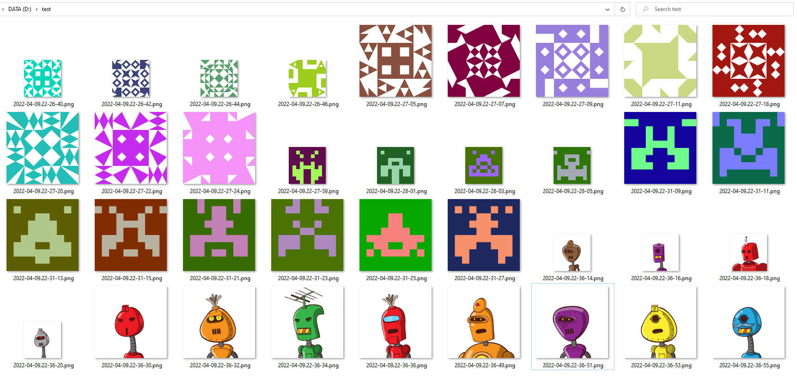
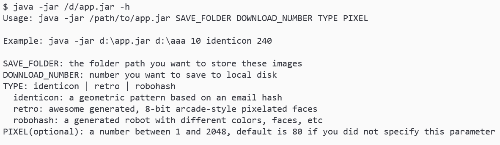

# avatars

---
  

gravatar 风格头像快速生成器。基于随机邮箱生成随机头像。使用后如果觉得有用欢迎点个 **免费的⭐️️~**

- 支持下载任意数量头像
- 支持不同风格头像，支持 identicon | retro | robohash，其他风格的头像必须是注册账号，目前随机邮箱只能生成这三种头像
- 支持设置头像分辨率（1 到 2048），满足不同尺寸头像的需求，生成的头像是正方形
- 其他感兴趣的可阅读 [官方说明](https://en.gravatar.com/site/implement/images/)



# 前言

本项目之前用了一个 [API](https://api.prodless.com/avatar.png) ，但是现在该 API 已经停止服务了。现借助 gravatar 官方的服务写了此程序。个人感觉现在注册的网站越来越多，很多网站注册后默认不提供头像，需要用户自行上传，我经常为找不到合适的头像发愁，每个网站使用相同的头像又觉得泄露了隐私，于是我就产生了这样的需求，生成这些静态文件后保存在本地文件夹中，以后设置头像时随便挑选一个喜欢的即可。

# 版本日志

- `v1.0.0` 版本过于久远，由于原 API 失效，现已不提供 jar 包下载。released on 2021-09-26
- `v1.0.1` 基于官方 API 实现，可以下载多种风格的头像。released on 2022-04-08
- `v1.0.2` 增加分辨率参数，可以下载不同分辨率的头像。released on 2022-04-09

# 使用说明



```
java -jar /path/to/app.jar SAVE_FOLDER DOWNLOAD_NUMBER TYPE PIXEL
```

程序依次接收 4 个参数，分别是 `保存路径`、`欲下载数量`、`风格类型`、`分辨率`，参数说明：

1. `SAVE_FOLDER`: 准备保存的文件夹
   1. Windows CMD 或 Powershell 使用 `d:\aaa` 这种形式，Windows GitBash 使用 `/d/aaa` 这种形式，Windows WSL 使用 `/mnt/d/aaa` 这种形式（tips: Windows 路径名不区分大小写）
   2. macOS、Linux 使用 `/mnt/ssd/aaa` 这种形式
2. `DOWNLOAD_NUMBER`: 下载的头像数量
3. `TYPE`: 风格类型，取值有 identicon | retro | robohash
4. `PIXEL`: 可选参数，不输入时默认下载像素值 `80` 的图片。支持 1 ~ 2048 之间的整数值（官方文档当中说最大是 1024，经测试最大应该是 2048，可能官方文档尚未更新）

程序说明：

每 2 秒下载一张头像，文件命名风格是 `yyyy-MM-dd.HH-mm-ss.png`，比如 `2021-09-26.14-13-35.png`。

目前可选的 Gravatar 服务地址有

- 官方地址: https://www.gravatar.com/avatar/
- 极客族: https://sdn.geekzu.org/avatar/
- loli: https://gravatar.loli.net/avatar/
- V2EX: https://cdn.v2ex.com/gravatar/

**本程序已封装好的 jar 包中使用的是极客族的源（适合国内用户使用）。**

如果使用下来网络超时建议 clone 本项目自行修改程序中 `serverUrl` 的值再编译打包成 jar 包执行 `mvn clean package -Dmaven.test.skip=true -U`。

欢迎使用。
